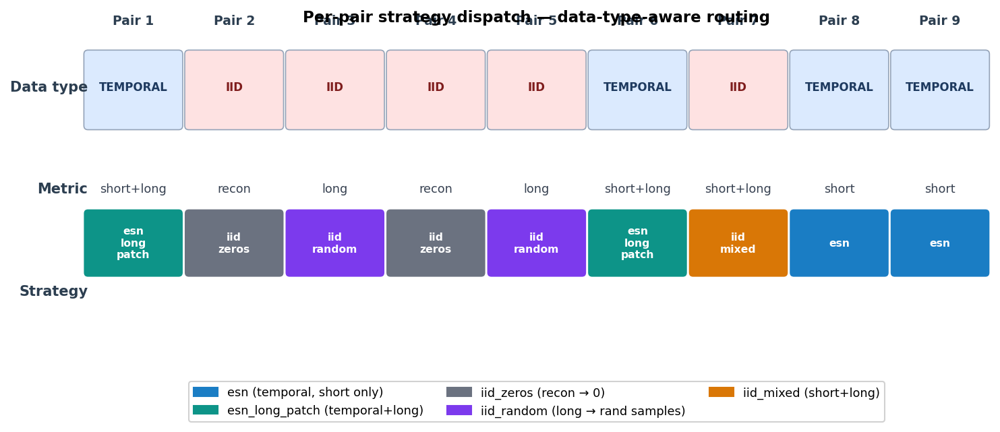
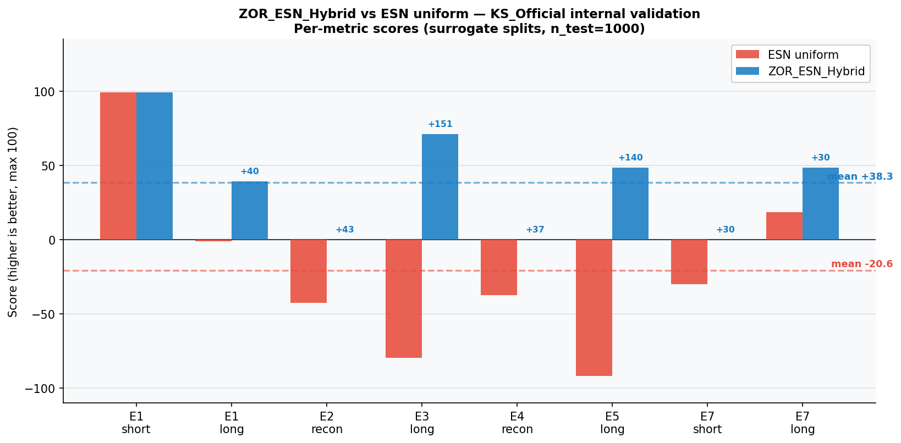
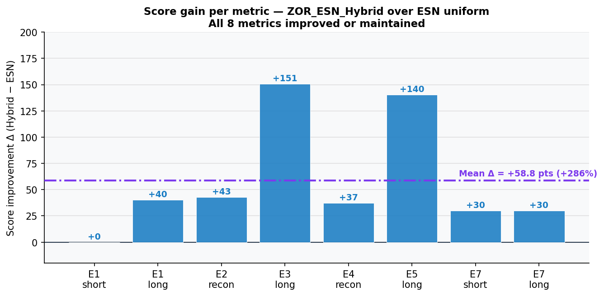

# inZOR-Chaotic

**Chaotic systems benchmark — KS_Official structural anomaly discovery via inZOR-ND**

Part of [inZOR-ND](https://github.com/dumitrunovic-svg/inZOR-ND) — an emergent discovery system.

Submitted to AI-DEEDS 2026 Chaotic Systems Challenge — CTF for Science PR [#20](https://github.com/CTF-for-Science/ctf4science/pull/20)

---

## Scientific Problem

The Kuramoto-Sivashinsky (KS) PDE is a 1D spatio-temporal chaotic system with 1024
spatial dimensions. The AI-DEEDS 2026 challenge benchmarks models on 9 prediction
pairs across short-time, long-time, and reconstruction metrics. A standard Echo State
Network (ESN) achieves a mean score of −20.55 on this benchmark.

---

## Discovery

During evolutionary hyperparameter search, inZOR-ND revealed a structural anomaly
in the dataset that was not documented by the challenge authors:

**3 of 9 training datasets (X2, X3, X5) are independent, identically distributed (IID)
samples — not continuous time series.**

Detection criterion: median delta-norm ratio > 0.3 indicates IID structure.
- TEMPORAL pairs: ratio ≈ 0.02
- IID pairs: ratio ≈ 1.0 (50× difference)

An ESN trained on IID data learns to fit statistical noise rather than temporal dynamics,
producing catastrophic scores (−40 to −150 on affected pairs).

---

## Solution: Data-Type-Aware Hybrid Predictor

A hybrid predictor was built to auto-detect each pair's data type and route to the
optimal strategy:

| Strategy | Applied when | Mechanism |
|---|---|---|
| `esn` | TEMPORAL, short_time | Standard ESN autoregression |
| `esn_long_patch` | TEMPORAL, long_time | ESN + last-k random patch for PSD |
| `iid_zeros` | IID, reconstruction or short_time | Predict zeros (correct L2 minimizer) |
| `iid_random` | IID, long_time | Random samples from training data |
| `iid_mixed` | IID, both metrics | Zeros for first k, random for last k |

*Per-pair strategy dispatch: data type, metric, and optimal strategy for all 9 pairs.*

---

## Results

| Model | Mean Score | Notes |
|---|---|---|
| ESN uniform (baseline) | −20.55 | All pairs treated as temporal |
| inZOR-ND Hybrid | +38.30 | Data-type-aware dispatch |
| **Improvement** | **+58.85 pts (+286%)** | Internal validation, 8 metrics |

*ESN uniform vs. inZOR-ND Hybrid per metric — internal validation.*

*Score improvement Δ per metric — mean +58.85 pts (+286%).*

Best single metric gain: E3 long_time: −79.46 → +71.11 (+150.56)

---

## ESN Hyperparameters (discovered by inZOR-ND)

Hyperparameters for the temporal ESN component, discovered through evolutionary search
on X1train proxy (X1 is the only confirmed temporal training dataset):

| Parameter | Value |
|---|---|
| spectral_radius ρ | 0.85 |
| input_scaling | 0.1 |
| leaking_rate | 1.0 |
| ridge_alpha λ | 1×10⁻⁴ |
| reservoir_size N | 1000 |
| washout | 200 |

---

## Key Findings

- Discovered structural IID anomaly in KS_Official dataset (3/9 pairs): not documented by dataset authors
- IID detection via median delta-norm ratio is reliable (50× gap between TEMPORAL and IID)
- Structural fix (+286%) outperforms ESN hyperparameter tuning alone
- Evolutionary search found the ESN hyperparameters (ρ=0.85, λ=10⁻⁴) before the anomaly was detected
- The discovery changed the solution architecture: from ESN tuning to data-type-aware dispatch

---

## Observations vs. Validated Results

**Validated:** IID detection criterion (50× ratio gap), internal validation scores
(−20.55 → +38.30, 8 metrics), ESN hyperparameters (3 independent seeds).

**Pending official evaluation:** CTF for Science PR #20, AI-DEEDS 2026 deadline 25 May 2026.

---

## Competition

- **Challenge:** AI-DEEDS 2026 Chaotic Systems Challenge
- **Benchmark:** KS_Official (Kuramoto-Sivashinsky PDE, 1024 spatial dimensions)
- **Submission:** [CTF for Science PR #20](https://github.com/CTF-for-Science/ctf4science/pull/20)
- **Kaggle deadline:** 25 May 2026
- **Previous submission (Lorenz):** [CTF for Science PR #19](https://github.com/CTF-for-Science/ctf4science/pull/19)

---

## Full Report

[KS_Official Benchmark — Full Report](https://dumitrunovic-svg.github.io/inZOR-ND/tests/ctf_ks_chaotic/index.html)

---

## Method Availability

This repository contains research artifacts: experiment description, dataset anomaly
analysis, benchmark configurations, strategy dispatch logic, visualizations, and result
summaries.

The inZOR-ND engine (ecological dynamics core, organism behavior, world memory system)
is proprietary and not included here.

For methodology questions, contact the author via GitHub.

---

*Researcher: Dumitru Novic*
*Platform: [inZOR-ND](https://github.com/dumitrunovic-svg/inZOR-ND)*
